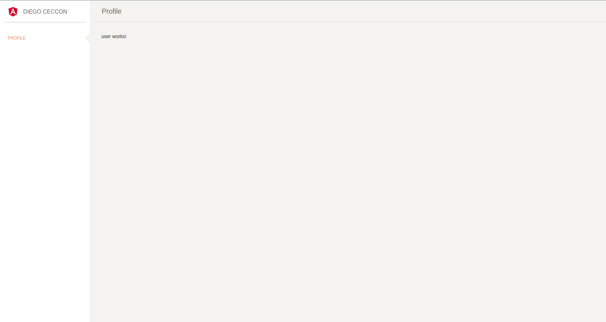

<p align="center">
  Exemple Angular Sidebar with Bootstrap v10.x
</p>

<p align="center">
  
</p>

## 💻 Projeto

This project was generated with [Angular CLI](https://github.com/angular/angular-cli) version 10.0.3.

## ✨ Tecnologia

- [Angular](https://angular.io/)
- [TypeScript](https://www.typescriptlang.org/)

## 📝 License

Esse projeto está sob a licença MIT. Veja o arquivo [LICENSE](LICENSE) para mais detalhes.

---

## Development server

Run `ng serve` for a dev server. Navigate to `http://localhost:4200/`. The app will automatically reload if you change any of the source files.

# angular-sidebar-bootstrap

## Terminal Commands

1. Install NodeJs from [NodeJs Official Page](https://nodejs.org/en).
2. Open Terminal
3. Go to your file project
4. Run in terminal: `npm install -g @angular/cli`
5. Then: `npm install`
6. And: `ng serve`
7. Navigate to: [http://localhost:4200/](http://localhost:4200/)

### What's included

Within the download you'll find the following directories and files:

```
├── README.md
├── angular.json
├── e2e
├── karma.conf.js
├── package.json
├── protractor.conf.js
├── src
│   ├── app
│   │   ├── app.component.scss
│   │   ├── app.component.html
│   │   ├── app.component.spec.ts
│   │   ├── app.component.ts
│   │   ├── app.module.ts
│   │   ├── app.routing.ts
│   │   ├── layouts
│   │   │   └── admin-layout
│   │   │       ├── admin.component.html
│   │   │       ├── admin.component.scss
│   │   │       ├── admin.component.spec.ts
│   │   │       ├── admin.component.ts
│   │   │       ├── admin.module.ts
│   │   │       └── admin.routing.ts
│   │   ├── pages
│   │   │   ├── upgrade
│   │   │   │   ├── user.component.html
│   │   │   │   └── user.component.ts
│   │   │   └── user
│   │   │       ├── user.component.html
│   │   │       └── user.component.ts
│   │   ├── shared
│   │   │   ├── sidebar
│   │   │   │   ├── sidebar.component.html
│   │   │   │   ├── sidebar.component.ts
│   │   │   │   └── sidebar.module.ts
│   │   │   ├── footer
│   │   │   │   ├── footer.component.html
│   │   │   │   ├── footer.component.ts
│   │   │   │   └── footer.module.ts
│   │   │   └── navbar
│   │   │       ├── navbar.component.html
│   │   │       ├── navbar.component.ts
│   │   │       └── navbar.module.ts
│   │   └──
│   ├── assets
│   │   ├── css
│   ├── environments
│   ├── favicon.ico
│   ├── index.html
│   ├── main.ts
│   ├── polyfills.ts
│   ├── styles.css
│   ├── test.ts
│   ├── tsconfig.app.json
│   ├── tsconfig.spec.json
│   └── typings.d.ts
├── tsconfig.json
└── tslint.json
```
